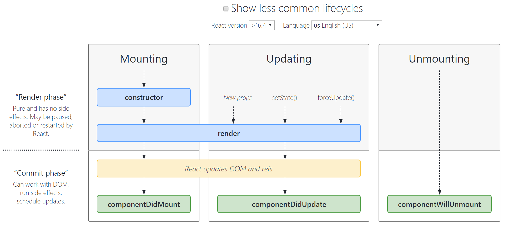

### 1. lifecyle

### 2. Templete
link: https://github.com/xietiankai/create-fullstack-vis-app

### 3. Structure of React
0> prerequisite: Docker  
1> The above link is the container of the React platform.  
* FrontEnd: React, Ant Design
* BackEnd:  Python

